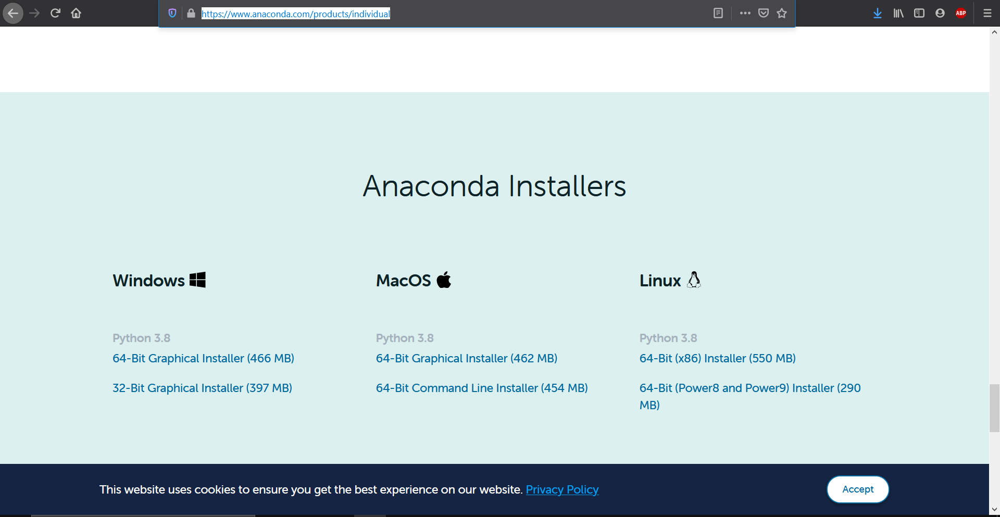
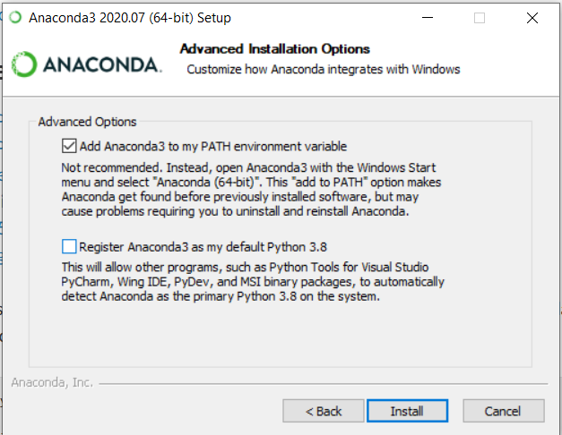
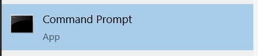
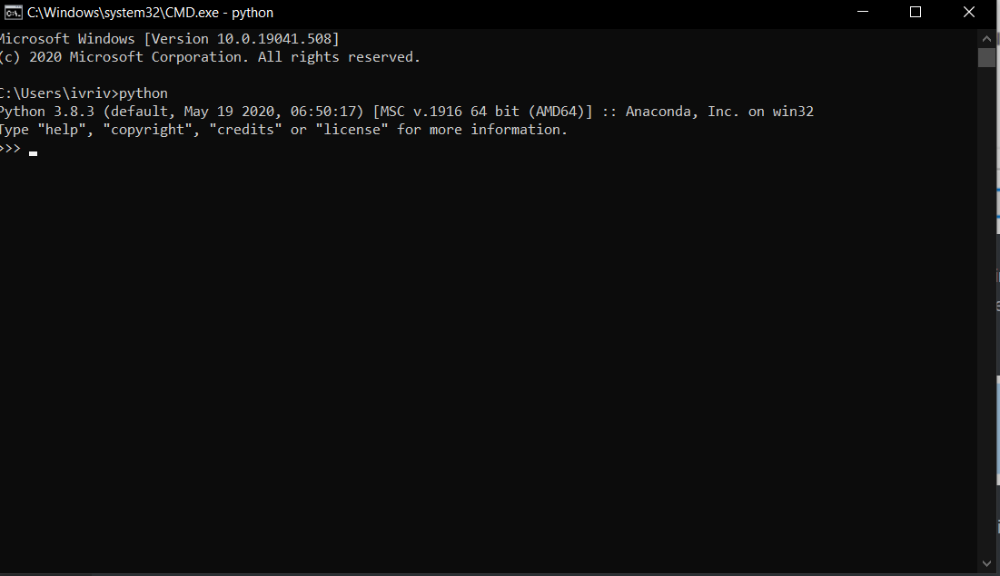
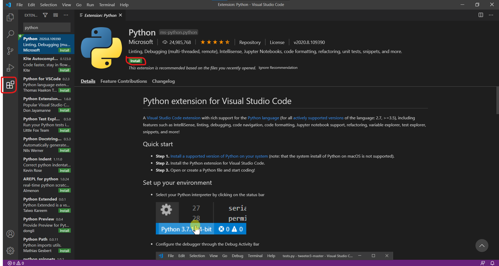

## Instalación de Python

Para poder comenzar con el taller es necesario tener instalado Python, si no sabes como instalarlo no te preocupes este tutorial te guiara paso a paso para instalarlo, todo depende de el sistema operativo que uses,

- <a href="python_windows">Windows</a>
- <a name="python_linux">Linux</a>

### Windows <a name="python_windows"></a>

Para instalar Python en Windows tenemos varias opciones,  la que utilizaremos será instalar [Conda](https://www.anaconda.com/products/individual) o [Miniconda](https://docs.conda.io/en/latest/miniconda.html) dependiendo del espacio que tengamos en nuestro disco duro. Si tenemos poco espacio en disco duro instalaremos **Miniconda** la cual es una versión chiquita de **Conda**

Empezamos descargando el instalador de [Conda](https://www.anaconda.com/products/individual) y seleccionamos la opción de Windows 64-bit o 32-bit dependiendo de nuestra computadora



Una vez descargado el instalador, lo ejecutaremos, y daremos clic en siguiente, siguiente... hasta llegar a la siguiente ventana



donde seleccionaremos la primera opción y daremos clic en instalar, esperaremos a que el instalador termine y listo, hemos instalado python3 en nuestra computadora, para verificar que lo hemos instalado correctamente abriremos una terminal, para ello pulsaremos la tecla de windows y buscaremos *cmd* y daremos clic,



Posteriormente escribiremos python y daremos enter, si todo ha salido bien veremos el siguiente mensaje,




### Linux <a name="python_linux"></a>

Procederemos a descargar el instalador de linux de la misma pagina [link de descarga de conda](https://www.anaconda.com/products/individual), posteriormente ejecutaremos el siguiente comando

```shell
bash ~/Downloads/Anaconda3-2020.02-Linux-x86_64.sh
```

 seguiremos las instrucciones para instalarlo, y las instrucciones que se muestran al finalizar, finalmente para comprobar que la instalación fue exitosa ejecutaremos el siguiente comando

```shell
conda list
```

 Para mayor información de como instalar 

- Anaconda: [documentación oficial de anaconda](https://docs.anaconda.com/anaconda/install/)
- Miniconda: [documentación oficial de miniconda](https://conda.io/projects/conda/en/latest/user-guide/install/index.html#regular-installation)

## Instalación de un Editor 

Hay una gran variedad de editores para trabajar con python, entre ellos se encuentra los siguientes,

- [vscode](https://code.visualstudio.com/)
- [pycharm](https://www.jetbrains.com/pycharm/)
- [spyder](https://www.spyder-ide.org/)
- otros, [atom](https://atom.io/), [notepad ++](https://notepad-plus-plus.org/downloads/), [vim](https://www.vim.org/), [sublime text](https://www.sublimetext.com/)

En este caso usaremos vscode, pero ere libre de escoger el que más te guste, para instalarlo, vamos a la pagina de [descargas de vscode](https://code.visualstudio.com/download), una vez descargado, ejecutamos el instalador y aceptamos la configuración por defecto

Para mayor información puedes consultar la [documentación oficial](https://code.visualstudio.com/docs/setup/setup-overview)

Una vez instalado, abriremos el editor y seleccionaremos extensiones en el lado izquierdo, es el icono con cuatro cuadritos, buscaremos python y daremos clic en instalar




